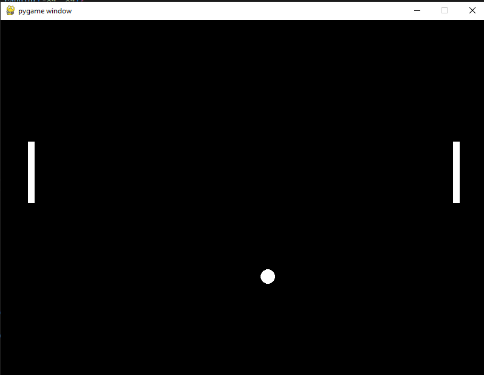

# June 17th: Time escaped me...

Alright, so a lot of time has gone into this one, so it might be a bit of a long devlog. 
tldr: I tried to reinvent the wheel and ended up scrapping most of my code. I also added a scoreboard, although it's just a CSV file atm. The video is showcasing bot vs. bot with all of the new changes. I think next devlog I will try to add sound effects, and maybe incorporate visual effects (I want something procedurally generated, but I noticed my PC can only handle ~1000 circles before it starts lagging)

In my last devlog, I had noticed that even after teleporting the paddle to the ball, there were some inconsistencies that caused the paddle to miss every once in a while. I had later discovered that the ray I was casting for the current ball velocity was completely wrong (mostly my fault), and it was easier to cast a ray by creating a straight pygame Vector2, then rotating it by my starting angle. 
I tried to keep my original ball reflections, then realized pygame had a built-in function for this too, and it's a lot easier to use. Collision detection was also switched over to the pygame equivalent, which fixed the ball bouncing around the inside of the paddle if the two happen to clip (it is still slightly buggy, but it mostly just causes the ball to hit the wall behind the paddle, which is what should happen anyway). 
I did get the "AIs" (which I will later be referring to as "bots" to be more accurate) to work (mostly). PID loops are confusing, and I couldn't get my jank solution to tune properly, so now I'm just checking if the paddle is within 1/2 its length of the target, then stopping. The bot is using the player controls, so it still has the drifty movement, which is why it sometimes over/undershoots and allows the player to score. 
Speaking of scoring, that's finally implemented with counters in both corners of the screen, and a placeholder leaderboard (just a .csv file). I also made some custom classes to handle text boxes, text inputs, and buttons. 

I figured for this week's video, I would record my whole screen to show off my workflow (and my [bongocat](https://store.steampowered.com/app/3419430/Bongo_Cat/) (it's free on Steam btw)).

# June 11th: Bugs... Gross...

Did a bit of bug fixing; the ball no longer clips into the backs of the paddles, and I fixed a lot of the broken math; there are not as many divide by zero errors. 
I did get the "AI" "working", but it's honestly just setting the paddle to a target, calculated by checking for the intersection between a ray cast from the ball at its current angle of movement, and a ray cast from the paddle. Later, this will be replaced with a PID loop, and the same constraints as the player-controlled paddle movement will be added. 
Even later (it might be a while, I'm still learning how to implement it in Python), I might switch over to machine learning with the NEAT algorithm.

**Total Time Spent: 6h**

# June 10th: Base application accomplished!

I got the base application created, with a very basic rendition of pong up and running. Currently, only one of the paddles works, there is no score counter, and the ball clips partially into the back side of the paddle (won't be an issue once scoring is implemented, but it's still kinda lazy).
I'll probably work on scoring and a very basic "AI" for next time (maybe even some sound effects?). I would eventually like to create some vfx, but I think pygame may be a bit laggy for that, atleast on my system.

**Total Time Spent: 4h**
